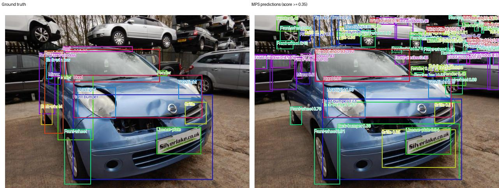
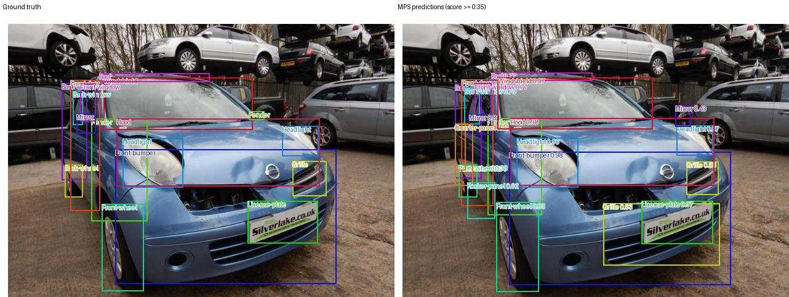

# SAM 3.1 Vehicle Part Detection

Fine-tuned SAM 3.1 detector for 21 exterior vehicle-part classes. The model
produces bounding boxes from a vehicle image and a text prompt for each part
class. It was trained with segmentation disabled, so this repository evaluates
**detection boxes**, not masks.

## How it was trained

The detector was fine-tuned from the SAM 3.1 multiplex checkpoint on a COCO
vehicle-parts dataset with 21 exterior-part classes. The transferred dataset
contains 849 training images with 13,317 instances and 149 validation images
with 2,450 instances.

Training used 12 epochs on one NVIDIA L40S GPU with bfloat16 mixed precision,
AdamW, 200 instance queries, and a batch size of one. Images were resized to a
1008-pixel square; training used scale jitter from 480 to 1008 pixels plus
bounded box-noise augmentation. The image and text towers were both
fine-tuned. See [training details](docs/TRAINING.md).

## Data processing

The source is the Humans in the Loop **Car Parts and Car Damages** dataset,
downloaded through KaggleHub from dataset version 2. This project uses the 998
car-part images and excludes the source dataset’s damage-only images. Its 21
classes span body panels, doors, windows, wheels, lights, grille, mirrors, and
license plates. The derived training split contains 849 images and 13,317
boxes; validation contains 149 images and 2,450 boxes.

The pipeline filters crowds and empty targets, decodes source annotations,
applies bounded box perturbation, scale-jitters each training image between 480
and 1008 pixels, pads to a 1008 × 1008 square, and normalizes with channel
mean/std `[0.5, 0.5, 0.5]`. Validation uses the same final resolution and
normalization without training-time perturbations. See [training details](docs/TRAINING.md)
for the complete configuration and loss setup, and [dataset provenance](docs/DATASET_PROVENANCE.md)
for source, licence, and conversion details.

## Results

The supplied historical prediction file was re-evaluated against the current
COCO validation annotations (149 images):

| Metric | Score |
| --- | ---: |
| COCO AP (IoU 0.50:0.95) | 0.731 |
| AP@50 | 0.917 |
| AP@75 | 0.788 |
| AR@100 | 0.808 |

AP@50 is average precision at an IoU threshold of 0.50; it is not a simple
percentage of correctly classified images. The supplied prediction file was
re-evaluated against the current validation annotations to produce these values.

### Matched baseline smoke benchmark

The Mac contained the vanilla upstream `sam3.pt` detector checkpoint. It shares
the image-detection core with the SAM 3.1 training starting point, while SAM
3.1 adds video-oriented enhancements. Both checkpoints were evaluated with
identical prompts on the same fixed eight validation images.

| Checkpoint | AP | AP@50 | AP@75 |
| --- | ---: | ---: | ---: |
| Local upstream SAM 3 baseline | 0.427 | 0.517 | 0.461 |
| Fine-tuned vehicle-parts checkpoint | 0.795 | 0.942 | 0.834 |
| Difference | +0.368 | +0.425 | +0.373 |

This is evidence that the parts fine-tuning materially improves detection on
the sampled vehicle-part validation images. It is a smoke benchmark; run all
149 validation images for release-quality comparison.

## Visual comparison

Each image below places ground truth on the left and model detections on the
right. The fine-tuned model recovers the vehicle parts more consistently and
with tighter boxes than vanilla SAM 3.

| Vanilla SAM 3 | Fine-tuned vehicle-parts model |
| --- | --- |
|  |  |

These are **detection** visualizations, not segmentation masks. The training
configuration sets `enable_segmentation: false`; a pixel-mask example would
require training or evaluating a segmentation-enabled checkpoint.

## Conclusion

This run shows that SAM 3's image-detection core can be fine-tuned effectively
for a focused domain task with a relatively small labeled dataset: 849 training
images achieved 0.731 AP and 0.917 AP@50 on the supplied 149-image validation
split. The matched vanilla-versus-fine-tuned sample benchmark also shows a
large improvement in part detection.

This should be treated as a strong task-specific result rather than a claim of
universal vehicle coverage. Performance still needs validation on the target
vehicle mix, viewpoints, image quality, damage conditions, and deployment
environment.

See [the model card](docs/MODEL_CARD.md) for per-class results, data details,
limitations, and intended use.

## Repository layout

```text
.
├── provenance/                 # Historical training configurations
├── docs/DATASET_PROVENANCE.md  # Dataset source and derived-data boundary
├── benchmark_mps.py            # Apple Silicon benchmark runner
├── eval_per_class.py           # COCO box evaluator with per-class AP/AP@50
├── vendor/sam3/                # Vendored SAM 3 implementation; not project code
├── docs/                       # Model card, training, and compatibility notes
└── results/                    # Local evaluation outputs; ignored by Git
```

Model weights, datasets, downloaded remote artifacts, and local Python
environments are intentionally excluded from Git. See `.gitignore`.

## Local evaluation

An Apple Silicon MPS runner is included for local evaluation only. It was
verified with Python 3.12, PyTorch 2.6.0, and torchvision 0.21.0. The original
training and historical evaluation used CUDA and bfloat16.

```sh
python3 -m venv .venv
.venv/bin/python -m pip install --upgrade pip
.venv/bin/python -m pip install -r requirements-local-mps.txt
```

Install a PyTorch/torchvision pair appropriate for your platform first if the
requirements resolver does not select one automatically.

## Data and checkpoint setup

The repository does not distribute either the dataset or the 10,009,567,404
byte checkpoint. Obtain them under the licences and permissions that apply to
your organization.

Expected paths:

```text
data/parts/
├── val.json
└── val_imgs/
    └── <vehicle images>

checkpoints/
└── checkpoint.pt
```

The verified checkpoint SHA-256 is:

```text
89033c6d9f7a3851a0d8c36621f48cbe98dd73f6d31ae97d5557637a9278e54a
```

Verify it after download:

```sh
shasum -a 256 checkpoints/checkpoint.pt
```

### Run MPS evaluation

Run a deterministic eight-image validation smoke evaluation:

```sh
.venv/bin/python benchmark_mps.py \
  --checkpoint checkpoints/checkpoint.pt \
  --data-root data/parts \
  --limit 8 \
  --output results/local-benchmark
```

Use `--limit 0` for every validation image. The runner writes COCO-format
predictions, aggregate metrics, timing data, metadata, and side-by-side ground
truth/prediction visualizations to the output directory.

## Re-evaluate existing predictions

```sh
.venv/bin/python eval_per_class.py \
  --gt data/parts/val.json \
  --predictions predictions.json \
  --output results/evaluation.json
```

## Notes for maintainers

- Use category IDs from `val.json`; do not hard-code a separate taxonomy.
- The actual transferred annotations contain 849 training images and 149
  validation images. The earlier delivery README's 1,098/122 split is stale.
- Original training preprocessing uses normalization mean/std `[0.5, 0.5,
  0.5]` and square 1008-pixel resize. It does not use ImageNet normalization.
- MPS runs in float32 and uses compatibility substitutions for a few
  CUDA-only operations. See [local benchmark notes](docs/LOCAL_MPS_BENCHMARK.md).
- Before publishing, review the applicable SAM 3 license, the dataset license,
  and any restrictions on distributing fine-tuned weights.
